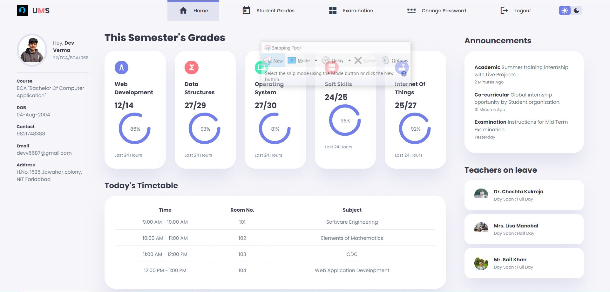

# 🎓 Student Dashboard – University Management System

A responsive and interactive **Student Dashboard** designed for a University Management System. This project displays semester grades, daily timetable, announcements, teacher availability, and more in a modern UI. Built using **HTML**, **CSS**, and **JavaScript**.

---

## 📌 Features

- 📊 **Semester Grades** with visual progress indicators
- 🗓️ **Daily Timetable** view with subject details
- 📣 **Announcements** section for updates
- 🧑‍🏫 **Teachers on Leave** information
- 👤 **Student Profile Card** with personal and academic details
- 🌙 **Dark Mode Toggle** for better accessibility
- 🔐 **Change Password** and **Logout** navigation

---

  

## 🛠️ Tech Stack

| Layer       | Technology    |
|-------------|----------------|
| Frontend    | HTML, CSS, JavaScript |
| Styling     | Custom CSS, Google Fonts, Material Icons |
| Interactivity | Vanilla JavaScript |

